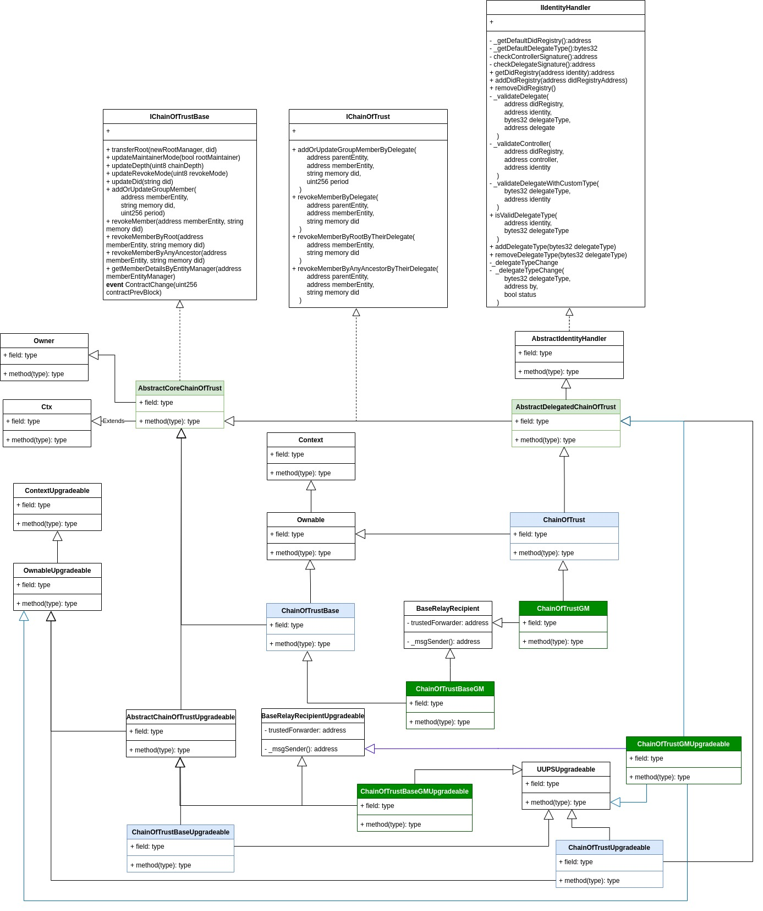

# Chain Of Trust

Chain of Trust smart contract is part of a stack of contracts that comprise Chain of Trust, a term coined with the concept of trust that provides entities the ability to verify whether another entity is trusted.

## Terminology

- Max depth: Maximum number of steps to go from any entity to the root entity (in the level `0`)
- entity: any participant in the root of trust contract.
- Root entity: The first trusted entity.

## Base Considerations

- Chain of Trust can be used as a reference which means applications using this component can use additional custom lists to make further filtering over a particular entity.
- The chain of trust concept starts with an entity that is set as the root entity. The root entity is set in the zero level of the chain of trust (The root level)
- At the zero level of trust (root level) there can be more than one entity.
- The root entity can add more members in a sort of trusted relationship by which the first one (parent entity) acknowledges the added entity (child entity) as a trusted member.
- Resolving whether a child entity is trusted depends on the number of steps ("levels") taken to reach the root entity.
- A child entity is trusted if "levels" is less or equal than the maximum depth" (an integer positive number defined on contract creation).
- When a child entity is added, the parent must specify the expiration time for the added child entity.
- A child entity is added just once.
- If the expiration time for an added child entity is reached then it is considered not trusted unless some other entity adds it again (it is possible to add the entity again only in the case of expiration time reached)
- An entity can claim to be associated with a decentralized identifier (DID). Validating that claim is accomplished by retrieving the DID document according to the DID method used in that specific DID and verifying whether the entity address appears in that document, the used relationship in the verification method can be specified in the Public Directory Smart Contract. The verification of that claim is outside of the scope of this contract.
- Any entity can update the decentralized identifier it claims to be is associated with.
- Revocation Mode refers to the capability to revoke an entity. There are three options:
  - REVOKEMODE=1: A parent entity can revoke a child entity it added AND a Root Entity can also revoke any child entity
  - REVOKEMODE=2: Any parent (including the root entity) can revoke any child entity, only if the parent

## Smart Contract Considerations

- Since the concept of Chain of Trust involves many entities, on deployment this contract sets a committee that acts as an owner in regards to the decisions taken for the deployed contract. The owner has two group of responsibilities (Maintainer and Base)
  - Maintainer Resposibilities are:
    - update the "depth" parameter (that represents the maximum depth)
    - update the "revocation mode" parameter
    - Transfer Root Entity
  - Base Resposibilities are:
    - Handle Upgrades.
    - Handle the ownership of the contract
- On contract deployment the deployer is assigned 'Maintainer' responsibilities. During that phase it is possible to also assign to the Root entity such responsibilities.
- The contract owner can update, at any time, Maintainer responsibilities to themselves or to the root entity.
- Base responsibilities are only handled by the owner of the contract.

## Smart contracts

Chan of Trust smart contract is architecturally composed by the follings:

- **Chain of Trust Base contract**: The Smart contract that exposes the core functionalities.
- **Chain of Trust**: The Smart contract that extends Chain of Trust Base contract and allows integration with a Did Registry Based on ERC-1056, this integration allows to treat each entity address in the root of trust as the base address on top of which an ERC-1056 compliant DID is created. Thus on adding a new entity it can be verified that the message sender is the controller of the did parent that attempts to add the new entity to the chain of trust. Furthermore delegates can send the transaction on behalf of the parent entity.

## Smart contracts Methods and Emmitted events

- [Chain of Trust Base contract](../../contracts/chainOfTrust/IChainOfTrustBase.sol)
- [Chain of Trust](../../contracts/chainOfTrust/IChainOfTrust.sol)

## Didactic Diagrams

In the following diagram depth=3 is exemplified

In the following diagram different groups are added at the same level, this shows how different entities endorse trust at different levels.

## Available Contracts

Contracts as mentioned in [smart contracts sections](./chainOfTrust.md#smart-contracts) are available for any EVM compatible network as well as for LACChain Gas Model Compatible Networks. For any of those cases there are two flavors of contracts availble, upgradeable and non-upgradeable contracts. Let's illustrate it:

## Contracts Diagram

The following picture shows the different subcomponents that comprises the Chain of Trust contracts.

