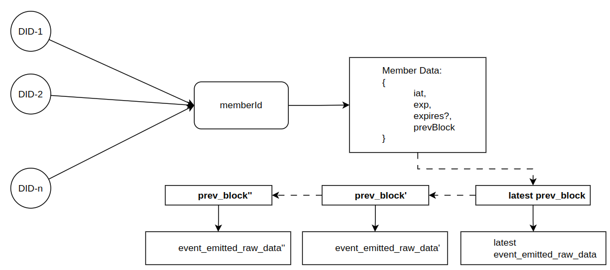
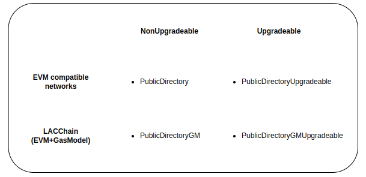

# Public Directory

Public directory smart contract holds minimal **public** identification data about entities. Data contained in the directory can then be used to identify entities that participate in certain contexts like collaborative project accross independent public/private institutions.

At a higher level, updates of this directory are subject to approval by a committee that includes the different organizations which have to reach a consensus before making changes. This contract is thus a pillar on top of which trust can be built where participants acknowledge the committee to make traceable changes and take these as valid.

## Terminology

## Base Considerations

- Among others, key data like Decentralized identifiers [DIDs](https://w3c.github.io/did-core/) are stored for every entity.
- One entity can have multiple DIDs.

## Smart Contract Considerations

- Every entity is assigned a unique identifier autogenerated by the contract when a member is added; so this can be used between the different DIDs and the public entity data. This allows any participant to know a transparent history about the different states an entity registered in the public directory has gone through since it was registered.

## Smart contracts

- [Public Directory](../../contracts/chainOfTrust/PublicDirectory.sol)

## Smart contracts Methods and Emmitted events

- [Public Directory](../../contracts/chainOfTrust/IPublicDirectory.sol)

## Didactic Diagram

The following diagram shows the comprising elements of a registry.

## Available Contracts

Contracts as mentioned in [smart contracts sections](./publicDirectory.md#smart-contracts) are available for any EVM compatible network as well as for LACChain Gas Model Compatible Networks. For any of those cases there are two flavors of contracts availble, upgradeable and non-upgradeable contracts. Let's illustrate it:

## Contracts Diagram

The following picture shows the different subcomponents that comprises the Public Directory smart contracts.

